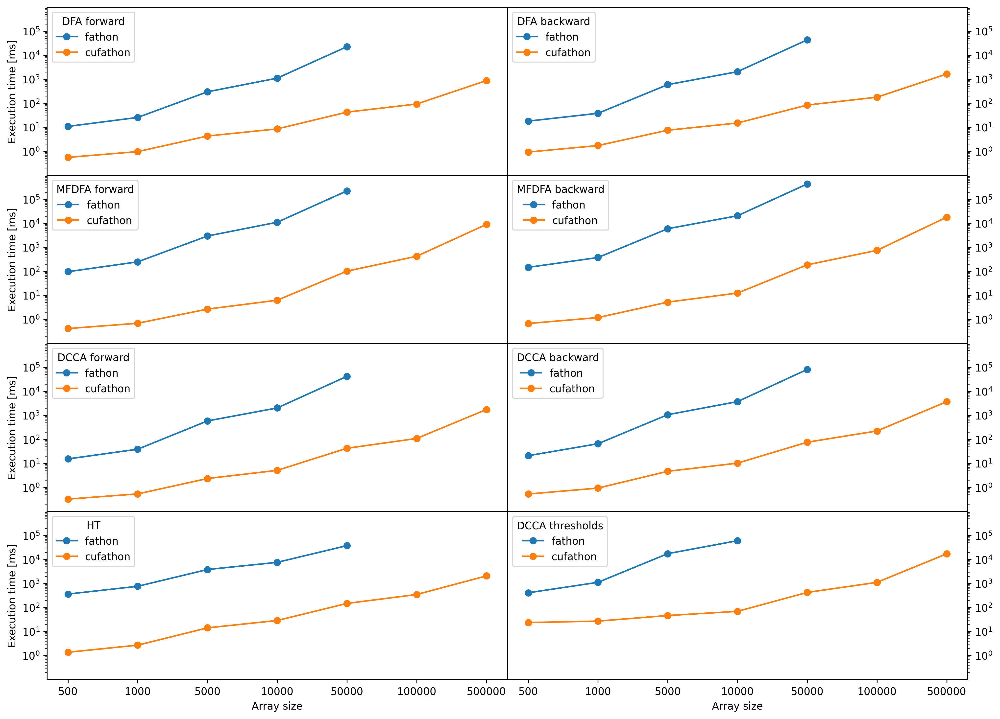

# cufathon

Some `fathon` algorithms (complete or partial), in CUDA.

The code has been developed and tested on a Tesla V100-PCIE-16GB, compute capability 7.0.

Device specs:

- Global memory: 16160 mb
- Shared memory: 48 kb
- Constant memory: 64 kb
- Block registers: 65536
- Warp size: 32
- Threads per block: 1024
- Max block dimensions: (1024, 1024, 64)
- Max grid dimensions: (2147483647, 65535, 65535)

## cufathon vs fathon (8 cores CPU)

